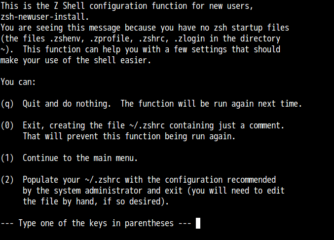

# 今から始めるzsh

date
:  2015/05/04

author
:   三宅 英明(mollifier)

theme
:   ligntning-gl-sample

# 自己紹介

- 名前: 三宅 英明
- Twitter: @mollifier
- はてなID: mollifier
- 神戸のプログラマ

{:caption="" relative_height="60" align="right"}

# 好きなもの
- zsh
- vim
- vimperator

{:caption="" relative_height="60" align="right"}

# ブログとか
はてなブログ
:    http://mollifier.hatenablog.com/

Twitter
:    http://twitter.com/mollifier

Qiita
:    http://qiita.com/mollifier

# 今から始めるzsh

# 今から始めるzsh
- でもその前に、みなさんシェルを使っていますか?

# シェルって何
- シェルとは、OSを操作するやつです

# シェルって何
- 大雑把に言うと、黒い画面です

# シェルの種類
- sh
- bash
- csh
- tcsh
- zsh

# シェルの種類
- ksh
- fish
- mash
- yash
- などなど

# シェルの種類
- いっぱいあります

# シェルの種類
- 何を使っても同じなのか?

# シェルの種類
- 強力なシェル、自分にあったシェルを選ぶことが大事

# なぜシェルは大事か
- シェルとは、OSを操作するやつです
- UNIX系OSでは、ほとんどの操作をシェルから行います

# シェルの種類
- 何でもシェルを使います
- 極端に言えば、シェルの操作だけ覚えておけばOK

# シェルの種類
- シェルの種類によって機能が違う。便利なシェルはめちゃ便利

# シェルの種類
- 逆に言うと、しょぼいシェルを使っていたら、いつまでたっても便利にならない

# シェルの種類
- だから強力なシェルを使って、便利なようにカスタマイズすることが大事

# シェルの種類
- シェルは大事
- シェルの勉強は、やってやりすぎることはない

# シェルの種類
しょぼい -> ふつう

- sh
- csh

# シェルの種類
ふつう -> すごい

- bash
- tcsh
- ksh

# シェルの種類
なんかしらんやつ

- fish
- mash
- yash

# シェルの種類
そして、我らがzsh

# シェルの種類
- zsh
- もう、すごいとかそういうレベルじゃない

# シェルの種類
- zsh
- すごいとか便利とか、そういう分類をすること自体がzshに失礼

# シェルの種類
- じゃあ何なのか?

# シェルの種類
- zshはもうシェルじゃないんですよ。宇宙なんですよ

# 今から始めるzsh
- 使ったことない人は今から始めてみましょう
- すでに使っている人は基本の復習

# zshとは
- zshとは究極のシェル

# zshとは
- zshはなんでもできる!

# zshとは
- 「zshでできないことがあったら、それはバグだ」

# zshとは
- みんなzshを使いたくなりましたね

# zshのインストール
UbuntuやDebian GNU/Linuxなどの場合

    % sudo apt-get install zsh

# zshのインストール
CentOSやRed Hat Enterprise Linuxなどの場合

    % sudo yum install zsh

# zshのインストール
Macの場合
最初から入っています

# zshのインストール
Macで最新版を使いたい場合

    % brew install zsh
    # または
    % sudo port install zsh

# ログインシェルをzshに変更

    # zshのパスを確認
    % which zsh
    /bin/zsh

    # /etc/shellsの内容を確認
    % cat /etc/shells
    /bin/bash
    /bin/tcsh
    /bin/zsh

    # /etc/shellsにzshのパスを追加。すでにある場合は不要
    % sudo sh -c "echo '/bin/zsh' >> /etc/shells"

# ログインシェルをzshに変更

    % chsh -s '/bin/zsh'

# ログインシェルをzshに変更
これでOK。
次にログインしたときからzshが動いている。

# 初回起動
初回起動時になんか聞かれる

{:caption="" relative_height="100" }

# 初回起動
- 実はほとんど役に立たない
- はっきり言って、おおきなお世話

# 初回起動
- 自分でカスタマイズしたい人は0を選ぶのが良い
- 0を押すと空の~/.zshrcが作成される(次回以降聞かれなくなる)

# zshの設定
- 今日はzsh勉強会なので、1からカスタマイズしてみましょう

# zshの設定
設定ファイルの種類

|名前|役割|
|:---|:---|
|~/.zshenv|zshが起動したときに必ず読み込まれる|
|~/.zshrc|対話的に起動したときに読み込まれる|

# zshの設定
- 他にもあるけど、基本この2種類だけでOK。
- もっというと、基本的には~/.zshrcに書いておけばOK。

# .zshrcの例

    # 環境変数
    export LANG=ja_JP.UTF-8

    # 補完機能を有効にする
    autoload -Uz compinit
    compinit

    # cd したら自動的にpushdする
    setopt auto_pushd
    # 重複したディレクトリを追加しない
    setopt pushd_ignore_dups

# .zshrcの例

    # グローバルエイリアス
    alias -g L='| less'
    alias -g G='| grep'

    # ヒストリの設定
    HISTFILE=~/.zsh_history
    HISTSIZE=1000000
    SAVEHIST=1000000

# .zshrcの例

    # emacs 風キーバインドにする
    bindkey -e

    # 日本語ファイル名を表示可能にする
    setopt print_eight_bit

    # beep を無効にする
    setopt no_beep

# .zshrcの例

    # フローコントロールを無効にする
    setopt no_flow_control

    # Ctrl+Dでzshを終了しない
    setopt ignore_eof

    # '#' 以降をコメントとして扱う
    setopt interactive_comments

# zshrcの例
- この.zshrcは次のURLに書いてある
- [https://gist.github.com/mollifier/4964803](https://gist.github.com/mollifier/4964803)
- とりあえずこんな感じのをコピペして、source ~/.zshrcする

# zshrcの例
- そのあと、そっとやさしくTabを押すと

# うわー、補完、補完。補完できるよ。

# 楽しい

# 今から始めるzsh
とりあえずこんな感じで、使いはじめるのは簡単です

# 今から始めるzsh
具体的になにがどう便利なのかは、次の発表で

# 今から始めるzsh
ありがとうございました

